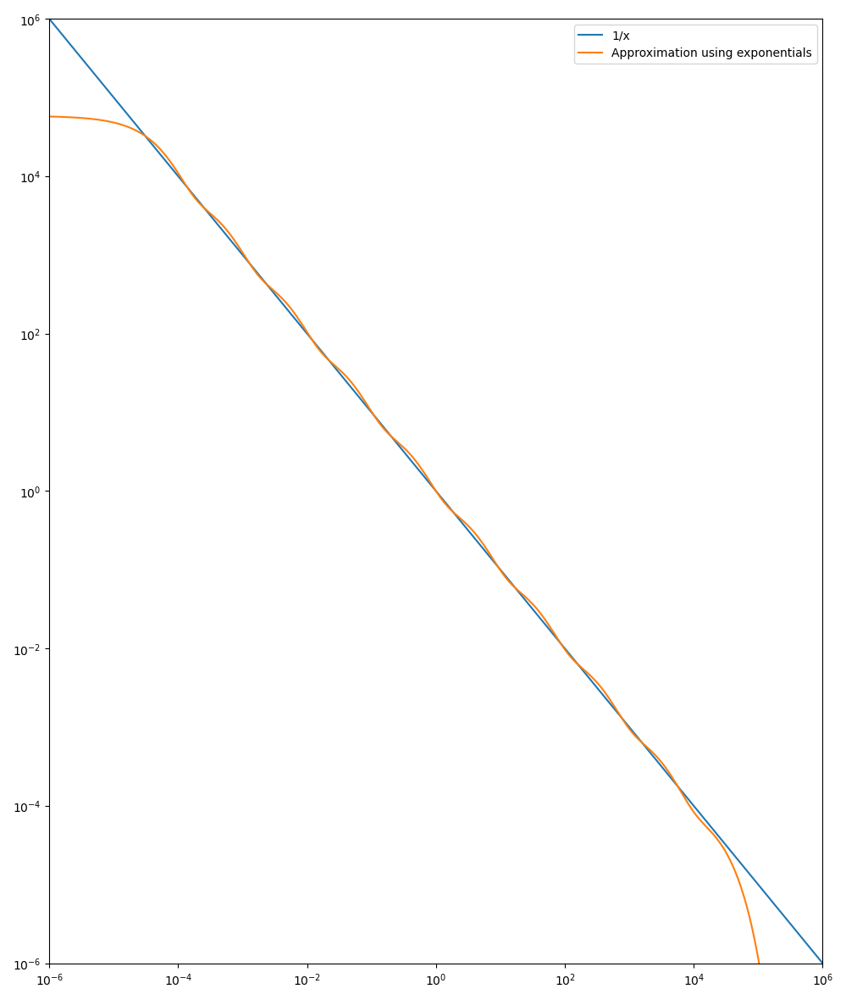

# RWKV with polynomial decay
This is an experimental project where I've replaced the exponential time decay in the RWKV language model by polynomial decay. The goal of the project is to improve the model's long-term memory.

## Background
[RWKV](https://github.com/BlinkDL/RWKV-LM) is an RNN language model with Transformer-level performance.
Recently, there has been a large focus on training the model with longer context lengths, as the model is not very effective at generalizing to context lengths beyond what was used during training. However, training with very long context lengths is difficult and expensive, so there is a need to also find other ways to improve the model's ability to utilize long-term memory.

RWKV's memory consists of several channels, each with a specific decay factor which specifies how much emphasis the channel should put on recent data compared to older data. For a channel with decay factor $w<0$, the attention to a data point of age $x$ is weighted by $e^{wx}$ and thus more recent data points (with smaller values of $x$) get larger weights.

## Exponential decay
I believe that the main reason why RWKV struggles with generalizing to larger context lengths is that the attention decays exponentially, because this means that unless $w$ is very close to $0$ almost no attention will be given to very old data. On the other hand, those channels for which $w$ is very close to $0$ will be dominated by the contributions from old data, and thus very slow to change when new data is coming in.

Bo Peng, the main author of RWKV, has previously suggested modifying the decay schedule by adding a constant term: $e^{wx}+C$. Here $C$ is a learnable channel-specific constant.
This would partially solve the issue, as it would allow the channel to capture both short-term and long-term information at the same time. However, the asymptotic behavior as the context width grows is problematic, as the constant term means that the total weight given to old data continues to grow indefinitely, eventually rendering the channel unable to capture short-term information.

## Polynomial decay
My proposal is to replace the exponential decay, $e^{wx}$, by a polygon decay, $x^w$. Here, $w < 0$ is again a channel-specific trainable constant.
A polynomial decay would yield better asymptotic behavior and allow the model to capture long-term information while still putting a greater emphasis on short-term information. It would make it easier for the model to generalize past the context length on which it was trained, because the weight trails off smoothly instead of abruptly as it does when using an exponential decay.

### Asymptotic justification
Let us take a look at how the attention weight is distributed as the context length tends to infinity, when using a polynomial decay instead of an exponential one. The behavior depends on the value of $w$, with two main cases:
* $w \geq -1$: In this case the attention given to the most recent, say, $1000$ data points will tend to $0$ as the context width tends to infinity. This is because $\int_{0}^{\infty} x^w \mathrm{d} x = \infty$, so the bulk of the weight will be on old data points.
* $w < -1$: In this case the attention given to the most recent $1000$ data points will not tend to 0, because $\int_{0}^{\infty} x^w \mathrm{d} x$ converges. This means that new data will still be able to meaningfully affect the channel's value regardless of how large the context length is. However, the contribution from old data also doesn't become negligible because the weight only decays polynomially, so if there is some important piece of information that the model saw long ago it will still be capable of remembering it.

In essence, I think polynomial decay strikes a good balance between attending to data points of different ages. With polynomial decay, the total attention given to data of ages in the range $[2^a, 2^{a+1}]$ is generally in the same order of magnitude as the total attention given to data of ages $[2^b, 2^{b+1}]$, which I think intuitively makes sense because when predicting the next word in a book you would probably want to pay attention to
* the preceding words in the sentence,
* the preceding sentences in the chapter, and
* the preceding chapters in the book,
  
and the total attention given to each of these should be in the same ballpark.

## How to approximate polynomial decay
The problem with polynomial decay is that it is more challenging to compute, as it doesn't suit the recursive structure of RWKV as well as the exponential decay does. The exponential attention that is currently used in RWKV can be computed easily in a recursive manner. Suppose we want to compute
$$E_t = \sum_{i=1}^{t-1} e^{w(t-i)+k_i} v_i$$
for all $t$ up to some limit. Then we can compute this recursively as
$$E_t = e^{w+k_{t-1}}v_{t-1} + e^w \sum_{i=1}^{t-2} e^{w(t-1-i)+k_i} v_i = e^{w+k_{t-1}}v_{t-1} + e^w E_{t-1}.$$
If we instead want to compute the sums
$$\sum_{i=1}^{t-1} (t-i)^w e^{k_i} v_i,$$
then there is no similar recursive formula. During training we could use FFT to compute this convolution somewhat efficiently, but during inference we would have no choice but to store all the previous $k_i$ and $v_i$ and compute the sums naively.

However, we can still get the benefits of polynomial decay even if we don't compute it exactly! And it is possible to approximate $x^w$ as a sum of exponentials in $x$. To see this, let us prove that if we allow ourselves to use an infinite number of exponentials we can compute $x^w$ exactly.

### Lemma
For any $w<0$, we are going to show that there exists a function $f_w:\mathbb{R} \rightarrow \mathbb{R}^{+}$ such that for all $x>0$,
$$x^w = \int_{-\infty}^{\infty} f_w(\alpha) e^{- x \exp(\alpha)} \mathrm{d}\alpha.$$
### Proof
Define $g_w:\mathbb{R}^{+} \rightarrow \mathbb{R}^{+}$ by
$$g_w(x) = \int_{-\infty}^{\infty} e^{-\alpha w-x\exp(\alpha)} \mathrm{d}\alpha$$
Then
$$g_w(x) = \int_{-\infty}^{\infty} e^{-\alpha w-x\exp(\alpha)} \mathrm{d}\alpha = \left[ \beta = \alpha + \ln(x) \right] = x^{w} \int_{-\infty}^{\infty} e^{-\beta w-\exp(\beta)} d\beta = x^{w} g_w(1) $$
Now define
$$f_w(\alpha) = \frac{e^{-\alpha w}}{g_w(1)}$$
and it follows that
$$\int_{-\infty}^{\infty} f_w(\alpha) e^{- x \exp(\alpha)} \mathrm{d}\alpha = \frac{1}{g_w(1)}\int_{-\infty}^{\infty} e^{-\alpha w - x \exp(\alpha)} \mathrm{d}\alpha = \frac{g_w(x)}{g_w(1)} = x^w.$$
□

Now that we know how to compute $x^w$ exactly as an integral over exponentials, we can get an approximation by selecting a finite number of the exponentials and computing their sum. Specifically, we are going to select $N$ equidistant values $\alpha_1, \alpha_2, \ldots \alpha_N$ ranging from $-C$ to $C$ for some constant $C$. In other words,
$$\alpha_i = \frac{2C(i-1)}{N-1}-C.$$
Then we can get an approximation $\widetilde{x^w}$ of $x^w$ by
$$\widetilde{x^w} = A \sum_{i=1}^N e^{-\alpha_i w - x\exp(\alpha_i)},$$
where $A$ is some constant.
This approximation will only be reasonable for $x$ in the range $[e^{-C}, e^C]$, but if $N$ is not too small then the approximation will be quite good for those $x$.

Here is a comparison of $x^w$ and $\widetilde{x^w}$ for $w=-1$, $N=10$ and $C=10$:


## Results
So far I have only been able to validate that this works on a small scale. I think a large scale training is the only way to know for sure what effects the proposed change would have, because small models trained on standard datasets aren't sophisticated enough to make full use of long context lengths, in which case it doesn't matter if the decay is exponential or polynomial.

However, I have seen promising results when training small models on relatively simple memory-focused tasks. For my test bed I'm using <em>generalized fizz buzz</em>, which is a version of the well-known [fizz buzz](https://en.wikipedia.org/wiki/Fizz_buzz) game but with more divisors beyond just $3$ and $5$, and more words than just <em>fizz</em> and <em>buzz</em>. The instances are randomly generated on demand so that I get a virtually infinite stream of training examples.

<details>
<summary>Example of what the generated fizz buzz data can look like</summary>

```
1
Zyzz
Lazz
ZyzzWyzz
Qizz
ZyzzLazzZyzz
Wezz
ZyzzWyzzSezz
LazzLuzz
ZyzzQizzXezz
Pizz
ZyzzLazzWyzzZyzz
13
ZyzzWezz
LazzQizzQazz
ZyzzWyzzSezz
17
ZyzzLazzZyzzLuzzCuzz
19
ZyzzWyzzQizzXezzJizz
LazzWezzVezz
ZyzzPizz
23
...
```

</details>

Training two `ctx256 L6 D512` models, one with exponential decay and one with polynomial decay, there is a clear difference in how well the models can handle this problem:


<details>
<summary>Training commands</summary>

The training commands I used for the above runs are as follows.

**Exponential decay**
```
cd RWKV-v4neo & python train.py --load_model "" --wandb "" --proj_dir "out" \
    --data_file "" --data_type "fizzbuzz" --vocab_size 0 \
    --ctx_len 256 --epoch_steps 100 --epoch_count 500 --epoch_begin 0 --epoch_save 10 \
    --micro_bsz 16 --n_layer 6 --n_embd 512 --pre_ffn 0 --head_qk 0 \
    --lr_init 6e-4 --lr_final 1e-5 --warmup_steps 0 --beta1 0.9 --beta2 0.99 --adam_eps 1e-8 \
    --accelerator gpu --devices 1 --precision tf32 --strategy ddp_find_unused_parameters_false --grad_cp 0 \
    --decay "exponential"
```

**Polynomial decay**
```
cd RWKV-v4neo & python train.py --load_model "" --wandb "" --proj_dir "out" \
    --data_file "" --data_type "fizzbuzz" --vocab_size 0 \
    --ctx_len 256 --epoch_steps 100 --epoch_count 500 --epoch_begin 0 --epoch_save 10 \
    --micro_bsz 16 --n_layer 6 --n_embd 512 --pre_ffn 0 --head_qk 0 \
    --lr_init 6e-4 --lr_final 1e-5 --warmup_steps 0 --beta1 0.9 --beta2 0.99 --adam_eps 1e-8 \
    --accelerator gpu --devices 1 --precision tf32 --strategy ddp_find_unused_parameters_false --grad_cp 0 \
    --decay "polynomial"
```

</details>

If I use larger models, the model with the exponential decay is also able to achieve a lower loss, but it appears that the model with polynomial decay makes more effective use of the channels it has at its disposal.

Of course, this is just a toy problem, and there is no guarantee that polynomial decay's advantage generalizes to larger models and real world datasets. To find out, we'll need to try it! 🙂️
